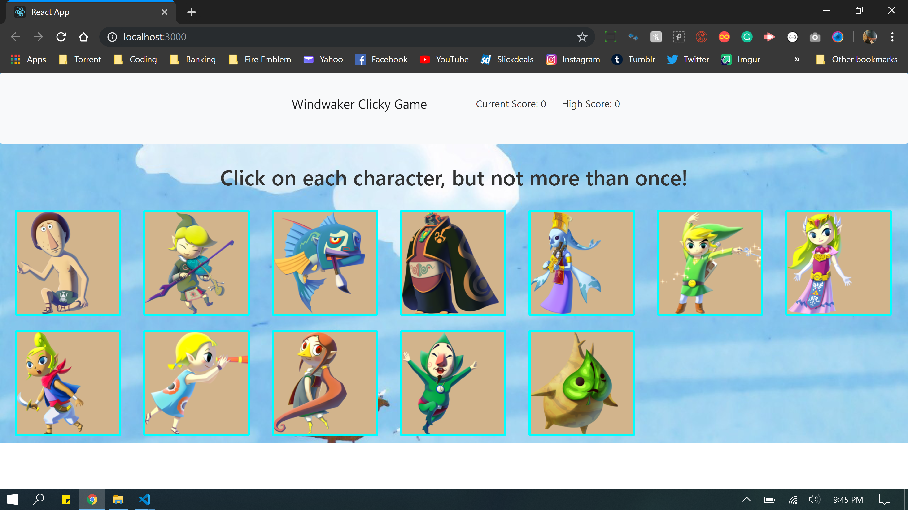

# Clicky-Game 
Homework 15

1. The problem my app is trying to solve
    - My app is a game designed to test your memory.

2. How is this app organized:
    - My app is composed of 4 components all rendered together into the App.js file.
        - The components are as follows:
            1. Card: The cards that are displayed to be clicked.
            2. Nav: The nav bar that displays the user score and highscore.
            3. Title: The text displayed instructing the user.
            4. Wrapper: The component that holds everything together.
        - The App.js contains imports of all of these components and use various function to facilitate the game logic.

3. How to run the app:
    - You being by clicking a card :]

4. Image of the code working
    - 

5. Deployed version of app:
    - Unfortunately Heroku was not complying with me. So, Calvin said it was okay for me to turn in just the repo.
    - We will go over what went wrong on Tuesday.

6. My app utilized the following:
    - Heroku
    - Bootstrap
    - Github
    - React
